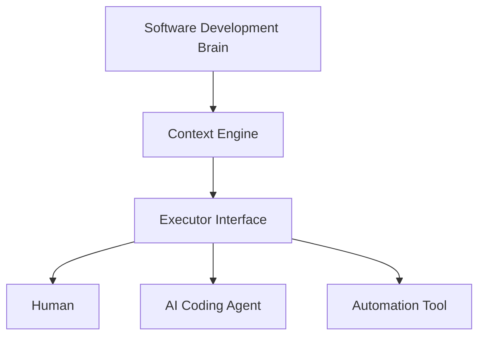
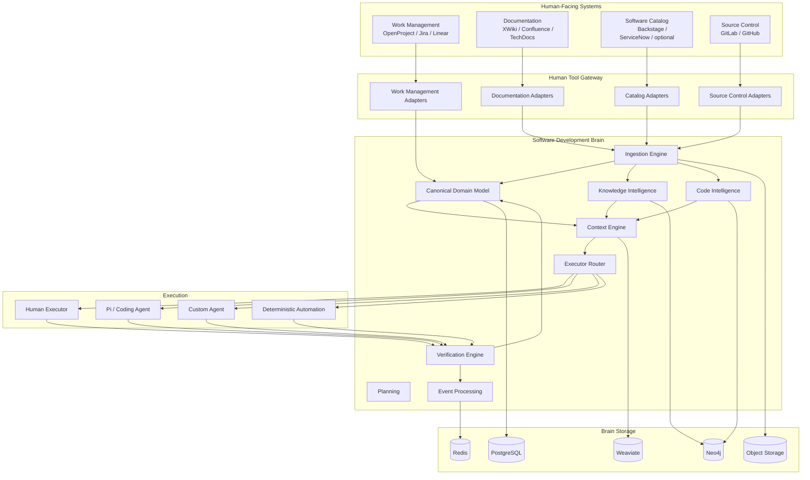
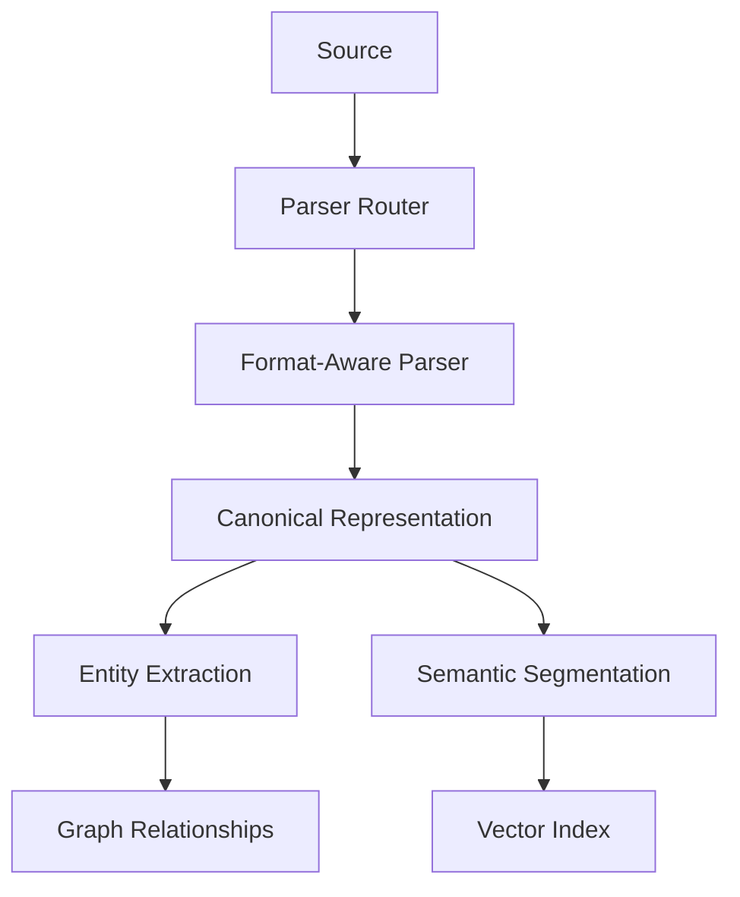
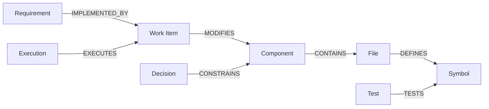
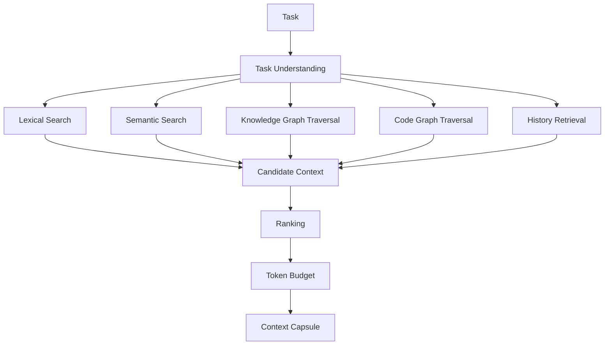
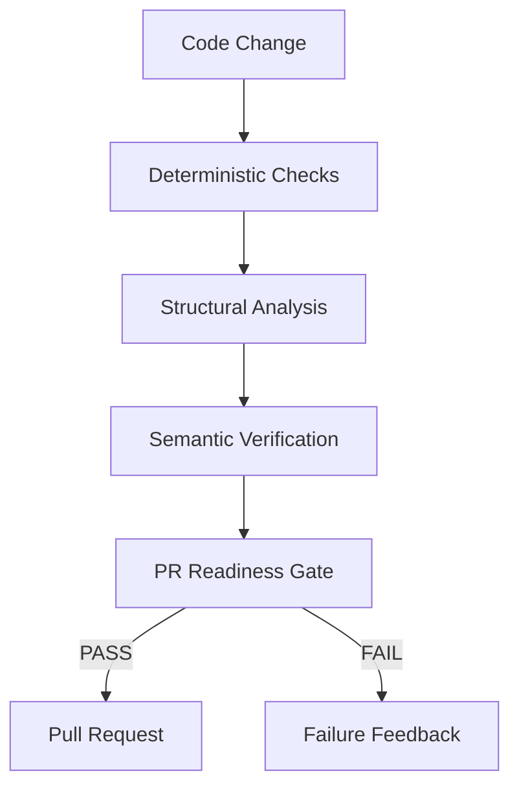

# Software Development Brain

> **A context-aware, tool-agnostic software-engineering automation platform that understands a software project, constructs precise task-specific context, assigns work to humans or AI agents, verifies the resulting code, and continuously updates its knowledge of the project.**

---

## Table of Contents

1. [Executive Summary](#1-executive-summary)
2. [Why This Project Exists](#2-why-this-project-exists)
3. [Core Design Philosophy](#3-core-design-philosophy)
4. [System Goals and Non-Goals](#4-system-goals-and-non-goals)
5. [High-Level Architecture](#5-high-level-architecture)
6. [The Brain vs Human-Facing Tools](#6-the-brain-vs-human-facing-tools)
7. [Interchangeable Tool Architecture](#7-interchangeable-tool-architecture)
8. [Canonical Domain Model](#8-canonical-domain-model)
9. [Identity, Versioning, Provenance, and Trust](#9-identity-versioning-provenance-and-trust)
10. [Project and Document Ingestion](#10-project-and-document-ingestion)
11. [Software Topology Discovery](#11-software-topology-discovery)
12. [Code Intelligence](#12-code-intelligence)
13. [Knowledge Graph](#13-knowledge-graph)
14. [Context Engine](#14-context-engine)
15. [Support for Small and Large Models](#15-support-for-small-and-large-models)
16. [Executors and Agents](#16-executors-and-agents)
17. [Using Existing Coding Agents Such as Pi](#17-using-existing-coding-agents-such-as-pi)
18. [Work Management and Task Intake](#18-work-management-and-task-intake)
19. [Planning and Work Decomposition](#19-planning-and-work-decomposition)
20. [Execution Workspace and Git Strategy](#20-execution-workspace-and-git-strategy)
21. [Verification Before Pull Request](#21-verification-before-pull-request)
22. [Human-in-the-Loop](#22-human-in-the-loop)
23. [Persistence Architecture](#23-persistence-architecture)
24. [Event Architecture](#24-event-architecture)
25. [End-to-End Data Flows](#25-end-to-end-data-flows)
26. [Conflict Detection and Reconciliation](#26-conflict-detection-and-reconciliation)
27. [Security and Permissions](#27-security-and-permissions)
28. [Failure Recovery and Checkpointing](#28-failure-recovery-and-checkpointing)
29. [Observability and Traceability](#29-observability-and-traceability)
30. [Scaling and Concurrency](#30-scaling-and-concurrency)
31. [Testing Strategy](#31-testing-strategy)
32. [Suggested Repository Structure](#32-suggested-repository-structure)
33. [Core Interfaces and Contracts](#33-core-interfaces-and-contracts)
34. [Configuration Model](#34-configuration-model)
35. [Example End-to-End Task](#35-example-end-to-end-task)
36. [Implementation Roadmap](#36-implementation-roadmap)
37. [Architectural Rules](#37-architectural-rules)
38. [Glossary](#38-glossary)

---

# 1. Executive Summary

The Software Development Brain is not primarily a coding agent.

It is a persistent software-engineering intelligence layer that maintains a structured, version-aware understanding of:

- requirements,
- architecture,
- software components,
- APIs,
- infrastructure resources,
- source code,
- symbol relationships,
- runtime dependencies,
- tests,
- project-management work items,
- architecture decisions,
- documentation,
- previous implementation attempts,
- verification results,
- human feedback,
- and engineering history.

The system uses this understanding to answer the most important question for every engineering task:

> **What is the smallest, most accurate, task-specific context required to perform this work correctly?**

This is a deliberate design constraint.

The platform should work with:

- very large frontier models,
- medium local models,
- small local models,
- narrow context windows,
- humans,
- deterministic automation,
- and external coding agents.

Large context windows are treated as an optimization, not as a requirement.

The platform should be able to operate with minimal external tooling:

```text
Git repository
+
user request
+
software-development brain
```

but it can integrate with human-facing systems when available:

```text
Work management:
    OpenProject / Jira / Linear / GitHub Issues / others

Documentation:
    XWiki / Confluence / TechDocs / Markdown / Notion / others

Software catalog:
    Backstage / ServiceNow / custom catalogs / none

Source control:
    GitLab / GitHub / Bitbucket / self-hosted Git

Coding executors:
    Pi / custom agent / local model agent / remote model agent / human

Internal storage:
    PostgreSQL / Neo4j / Weaviate / Redis
```

External human tools are **interchangeable interfaces**, not the core architecture.

The brain owns the canonical engineering model.

---

# 2. Why This Project Exists

Most coding-agent systems follow a model similar to:

```text
User prompt
    ↓
LLM
    ↓
Repository search
    ↓
Code changes
```

This works for small repositories and isolated tasks, but it becomes unreliable when software projects contain:

- many repositories,
- thousands of source files,
- long project histories,
- multiple services,
- undocumented dependencies,
- architectural constraints,
- partially implemented features,
- stale documentation,
- many project-management tickets,
- multiple developers,
- conflicting branches,
- large test suites,
- and small-context models.

The fundamental problem is not simply code generation.

The harder problem is **project understanding**.

A model implementing a task must know:

```text
What requirement does this task satisfy?

What parts of the repository implement the current behavior?

Which files and symbols are likely affected?

Which APIs or database schemas may be impacted?

Which architecture decisions constrain the change?

Which tests prove that the requirement is satisfied?

What was already attempted?

Why did previous attempts fail?

Which version of the source code is current?

What is fact, what is inferred, and what may be stale?
```

The Software Development Brain exists to answer these questions before and during execution.

---

# 3. Core Design Philosophy

## 3.1 The Brain Is the Center, Not the Agent

Agents are workers.

They are replaceable.

The brain owns:

- project understanding,
- canonical project state,
- task context,
- knowledge relationships,
- execution history,
- verification evidence,
- routing decisions,
- and long-term engineering memory.

The agent owns only the current execution session.



---

## 3.2 Context Must Be Constructed, Not Accumulated

The system should not solve context problems by sending an entire repository into the LLM.

Instead:

```text
Task
  ↓
Task analysis
  ↓
Knowledge retrieval
  ↓
Code graph traversal
  ↓
Impact analysis
  ↓
Historical retrieval
  ↓
Context ranking
  ↓
Token-budget optimization
  ↓
Context Capsule
```

A context capsule is expected to contain only what is useful for the current work.

---

## 3.3 Human Tools Are Optional Projections

The brain should not internally depend on Jira, OpenProject, XWiki, Confluence, or Backstage models.

Instead:

```text
External representation
        ↓
Adapter
        ↓
Canonical brain model
```

For example:

```text
OpenProject WorkPackage ─┐
Jira Issue ──────────────┼──> WorkItem
Linear Issue ────────────┘
```

The same applies to documents and software catalogs.

---

## 3.4 Deterministic Evidence Outranks Agent Claims

An agent saying:

> "The implementation is complete."

is only a claim.

Completion should be supported by evidence:

```text
Git diff
Tests
Build
Type checks
Static analysis
Architecture checks
Security checks
Requirement verification
Integration tests
```

The verification pipeline decides whether code is ready for pull request.

---

## 3.5 Knowledge Must Be Versioned

A software fact is not universally true.

For example:

```text
AuthService.login()
CALLS
UserRepository.find_by_email()
```

may only be true for:

```text
repository = auth-service
branch = feature/login
commit = 9c31e72
```

Knowledge must therefore be tied to repository state.

---

## 3.6 Declared, Discovered, Observed, and Inferred Knowledge Must Be Separated

The brain should know how a fact was obtained.

```text
DECLARED
    human-written metadata
    architecture docs
    project-management data
    Backstage catalog

DISCOVERED
    AST analysis
    manifests
    OpenAPI
    imports
    static code analysis

OBSERVED
    test execution
    traces
    logs
    runtime behavior

INFERRED
    LLM reasoning
    semantic classification
    probable relationships
```

These sources should have different trust levels.

---

# 4. System Goals and Non-Goals

## Goals

The system should:

1. maintain a continuously evolving model of a software project;
2. ingest both structured and unstructured engineering information;
3. understand relationships between requirements, tasks, code, tests, architecture, and runtime components;
4. create accurate, bounded context capsules;
5. support small and large models;
6. treat humans and agents as interchangeable task executors where practical;
7. integrate with multiple project-management and documentation systems;
8. verify changes independently before pull request;
9. support partially implemented projects;
10. preserve why engineering decisions were made;
11. detect stale or conflicting knowledge;
12. recover from interrupted workflows;
13. provide complete traceability from requirement to implementation to verification;
14. work when optional human-facing integrations are missing.

## Non-Goals

The core brain should not:

- become tightly coupled to one issue tracker;
- depend on Backstage metadata being manually maintained;
- treat vector search as the entire knowledge system;
- trust an LLM as the only verifier;
- require a million-token context window;
- store all project state inside agent conversations;
- use OpenProject/Jira IDs as internal primary keys;
- assume documentation is always correct;
- assume static code analysis captures all runtime behavior.

---

# 5. High-Level Architecture



---

# 6. The Brain vs Human-Facing Tools

Human tools should remain tools that people are comfortable using.

The brain should not force users to adopt a specific ecosystem.

## Work Management

Human tools may include:

```text
OpenProject
Jira
Linear
GitHub Issues
GitLab Issues
Azure DevOps
custom internal systems
```

The brain sees all of them as:

```text
WorkItem
```

---

## Documentation

Human tools may include:

```text
XWiki
Confluence
TechDocs
Markdown in Git
Notion
SharePoint
PDF
DOCX
HTML
```

The brain sees them as:

```text
Document
DocumentVersion
DocumentNode
KnowledgeClaim
```

---

## Software Catalog

Possible human-maintained catalogs:

```text
Backstage
ServiceNow
custom inventory
architecture repository
none
```

The brain sees:

```text
Domain
System
SoftwareComponent
Interface
Resource
Ownership
Dependency
```

If no catalog exists, the brain discovers the structure from code, configuration, deployment definitions, manifests, and repository topology.

---

# 7. Interchangeable Tool Architecture

Use a Ports-and-Adapters / Hexagonal Architecture.

The core domain should depend on interfaces.

It should never directly depend on provider classes.

## Example

Bad:

```python
async def handle_task(task: OpenProjectWorkPackage):
    ...
```

Good:

```python
async def handle_work_item(work_item: WorkItem):
    ...
```

Provider adapters perform translation.

```text
OpenProjectWorkPackage
        ↓
OpenProjectAdapter
        ↓
WorkItem
```

```text
JiraIssue
        ↓
JiraAdapter
        ↓
WorkItem
```

## Primary Integration Ports

```python
class WorkManagementPort(Protocol):
    ...

class DocumentationPort(Protocol):
    ...

class SoftwareCatalogPort(Protocol):
    ...

class SourceControlPort(Protocol):
    ...

class PullRequestPort(Protocol):
    ...

class CIValidationPort(Protocol):
    ...

class IdentityPort(Protocol):
    ...
```

## Internal Infrastructure Ports

```python
class StateRepository(Protocol):
    ...

class KnowledgeGraphRepository(Protocol):
    ...

class SemanticIndex(Protocol):
    ...

class CheckpointStore(Protocol):
    ...

class ObjectArtifactStore(Protocol):
    ...
```

This allows:

```text
SemanticIndex
 ├── Weaviate
 ├── Qdrant
 ├── Milvus
 └── pgvector
```

without changing the context engine.

---

# 8. Canonical Domain Model

The domain model is the stable center of the platform.

## 8.1 Project

```python
class Project(BaseModel):
    id: UUID
    name: str
    description: str | None
    status: str
    repositories: list[UUID]
    external_refs: list["ExternalReference"]
```

A Project is independent of an OpenProject project, Jira project, or GitLab group.

---

## 8.2 Repository

```python
class Repository(BaseModel):
    id: UUID
    project_id: UUID
    name: str
    clone_url: str
    default_branch: str
    current_revision: str | None
    external_refs: list["ExternalReference"]
```

---

## 8.3 WorkItem

A unit of engineering work.

```python
class WorkItem(BaseModel):
    id: UUID
    project_id: UUID
    type: str
    title: str
    description: str
    status: str
    priority: str | None
    parent_id: UUID | None
    assignee: UUID | None
    acceptance_criteria: list[str]
    requirement_refs: list[UUID]
    external_refs: list["ExternalReference"]
```

Possible types:

```text
Epic
Feature
Story
Task
Bug
Investigation
Refactoring
Verification
Documentation
Operations
```

---

## 8.4 Requirement

```python
class Requirement(BaseModel):
    id: UUID
    project_id: UUID
    key: str | None
    title: str
    description: str
    status: str
    priority: str | None
    acceptance_criteria: list[str]
    source_refs: list["SourceReference"]
```

---

## 8.5 Document

```python
class Document(BaseModel):
    id: UUID
    project_id: UUID
    type: str
    title: str
    source: "DocumentSource"
    current_version_id: UUID | None
```

---

## 8.6 DocumentVersion

```python
class DocumentVersion(BaseModel):
    id: UUID
    document_id: UUID
    source_version: str | None
    repository_id: UUID | None
    commit_sha: str | None
    checksum: str
    ingested_at: datetime
```

---

## 8.7 DocumentNode

Documents are stored structurally, not only as chunks.

```python
class DocumentNode(BaseModel):
    id: UUID
    version_id: UUID

    node_type: str
    title: str | None
    heading_path: list[str]

    content: str

    parent_id: UUID | None
    child_ids: list[UUID]

    code_refs: list[str]
    requirement_refs: list[UUID]
    work_item_refs: list[UUID]
    links: list[str]
```

---

## 8.8 SoftwareComponent

```python
class SoftwareComponent(BaseModel):
    id: UUID
    project_id: UUID

    name: str
    component_type: str

    repository_ids: list[UUID]

    owner: UUID | None
    lifecycle: str | None

    provenance: list["KnowledgeEvidence"]
```

Examples:

```text
backend service
frontend application
library
worker
CLI
data pipeline
embedded firmware
infrastructure module
```

---

## 8.9 Interface

```python
class Interface(BaseModel):
    id: UUID
    component_id: UUID
    type: str
    name: str
    schema_ref: str | None
```

Examples:

```text
REST API
GraphQL API
gRPC API
message topic
Python public interface
shared database contract
```

---

## 8.10 Resource

Represents infrastructure/runtime dependencies.

```text
PostgreSQL
Redis
Kafka
S3
MinIO
Kubernetes
filesystem
external SaaS
```

---

## 8.11 Artifact

Engineering output or input.

```python
class Artifact(BaseModel):
    id: UUID
    project_id: UUID
    artifact_type: str
    uri: str | None
    checksum: str | None
    repository_id: UUID | None
    commit_sha: str | None
```

Examples:

```text
source file
patch
commit
build
test report
container image
configuration
document
trace
coverage report
```

---

## 8.12 Execution

One attempt to perform work.

```python
class Execution(BaseModel):
    id: UUID
    workflow_id: UUID
    work_item_id: UUID

    executor_id: UUID
    context_capsule_id: UUID

    status: str

    started_at: datetime
    completed_at: datetime | None

    parent_execution_id: UUID | None
    correlation_id: UUID
```

Multiple executions may exist for one task.

```text
TASK-42
 ├── Execution 1 → implementation failed
 ├── Execution 2 → tests failed
 └── Execution 3 → verification passed
```

---

## 8.13 Evidence

```python
class Evidence(BaseModel):
    id: UUID
    execution_id: UUID
    evidence_type: str
    source: str
    artifact_id: UUID | None
    payload: dict
```

---

## 8.14 Decision

Architecture and engineering decisions must survive beyond the conversation that created them.

```python
class Decision(BaseModel):
    id: UUID
    project_id: UUID
    title: str
    context: str
    decision: str
    alternatives: list[str]
    consequences: list[str]
    status: str
    source_refs: list["SourceReference"]
```

---

## 8.15 Actor

Humans and agents should share a common abstraction.

```python
class Actor(BaseModel):
    id: UUID
    actor_type: str
    display_name: str
    capabilities: list[str]
```

Possible values:

```text
human
agent
automation
system
ci
```

This allows:

```text
Task
  └── assigned_to
          ↓
        Actor
```

---

# 9. Identity, Versioning, Provenance, and Trust

## 9.1 Internal IDs Must Be Stable

Never make the Jira issue key or OpenProject work-package ID the internal primary key.

Use:

```text
brain WorkItem ID = UUID
```

with external references:

```python
class ExternalReference(BaseModel):
    provider: str
    external_id: str
    url: str | None
    project_or_space: str | None
```

Example:

```text
Brain WorkItem:
    48f2...

External references:
    jira: AUTH-42
    openproject: 2148
```

A migration from Jira to OpenProject does not change the brain identity.

---

## 9.2 Every Software Fact Needs Version Scope

A relationship may contain:

```text
repository_id
branch
commit_sha
valid_from
valid_to
```

For example:

```text
subject:
    AuthService.login

relation:
    CALLS

object:
    UserRepository.find

repository:
    auth-service

commit:
    0d6124d
```

---

## 9.3 Provenance Is Mandatory

Knowledge should carry evidence.

```python
class KnowledgeEvidence(BaseModel):
    source_type: str
    source_id: str | None
    discovery_method: str
    observed_at: datetime
    confidence: float
    commit_sha: str | None
```

Possible discovery methods:

```text
human_declared
catalog_import
document_parse
ast_static_analysis
manifest_analysis
llm_inference
runtime_trace
test_observation
git_history
```

---

## 9.4 Trust Hierarchy

Trust is context-dependent, but a default precedence can be:

```text
Observed deterministic evidence
        >
Static deterministic evidence
        >
Human-declared structured metadata
        >
Human prose documentation
        >
LLM inference
```

Conflicts should not be hidden.

They should be represented.

---

# 10. Project and Document Ingestion

Ingestion transforms external project information into the canonical brain model.

## 10.1 Ingestion Sources

```text
Git repositories
README files
Markdown
PDF
DOCX
HTML
XWiki
Confluence
TechDocs
OpenAPI
AsyncAPI
GraphQL
protobuf
JSON Schema
Terraform
Docker Compose
Kubernetes
package manifests
project-management tickets
architecture decision records
CI results
runtime traces
```

---

## 10.2 Do Not Start With Chunking

Bad pipeline:

```text
PDF
 ↓
split every 1000 tokens
 ↓
embedding
 ↓
vector DB
```

Preferred pipeline:



Embeddings are an indexing layer, not the source representation.

---

## 10.3 Parser Registry

```python
class DocumentParser(Protocol):
    async def parse(self, source: SourceArtifact) -> ParsedDocument:
        ...
```

Implementations may include:

```text
MarkdownParser
HTMLParser
DoclingParser
OpenAPIParser
AsyncAPIParser
JsonSchemaParser
ADRParser
BackstageCatalogParser
XWikiParser
ConfluenceParser
OpenProjectParser
JiraParser
```

Code parsing should use language-aware parsers rather than generic document parsing.

---

## 10.4 External Office/PDF Documents

A structured document converter such as Docling may be used for:

```text
PDF
DOCX
PPTX
HTML
image-based documents
```

Its output should still be normalized into the brain's own canonical document schema.

The ingestion architecture must not depend on Docling's internal schema.

---

## 10.5 Semantic Segmentation

Chunks should follow semantic boundaries.

### Documentation

```text
heading
section
subsection
paragraph group
```

### Requirements

```text
requirement
acceptance criteria
constraints
```

### ADRs

```text
context
decision
alternatives
consequences
```

### APIs

```text
endpoint
request schema
response schema
error behavior
```

### Source code

```text
module
class
function
method
symbol group
```

---

## 10.6 Incremental Ingestion

The system should not re-ingest the entire project after every commit.

```text
Git push
   ↓
Changed files
   ↓
Parser selection
   ↓
Canonical diff
   ↓
Graph delta
   ↓
Embedding delta
   ↓
Brain state update
```

Store content hashes.

If the content hash is unchanged, skip parsing.

---

# 11. Software Topology Discovery

Backstage or another catalog may provide software structure.

But the platform must work without it.

## 11.1 Declared Topology

Possible sources:

```text
Backstage catalog-info.yaml
architecture metadata
deployment inventory
human configuration
```

---

## 11.2 Discovered Topology

The brain should derive components from:

```text
repository boundaries
pyproject.toml
package.json
go.mod
Cargo.toml
Dockerfile
docker-compose.yml
Kubernetes manifests
Helm charts
Terraform
OpenAPI files
message schemas
service configuration
code-level dependencies
```

---

## 11.3 Example

The brain may discover:

```text
payment-service

type:
    FastAPI service

provides:
    payment REST API

depends on:
    PostgreSQL
    Redis
    inventory-service

repository:
    services/payment
```

If a Backstage catalog later appears, the brain can reconcile:

```text
brain-discovered topology
+
human-declared topology
```

rather than replacing one with the other.

---

# 12. Code Intelligence

Code Intelligence is more than a call graph.

It is the subsystem that answers:

> **What code is related to this task and what could be affected by a change?**

## 12.1 Structural Hierarchy

```text
Repository
  ↓
Package
  ↓
Module
  ↓
File
  ↓
Class
  ↓
Method / Function
```

---

## 12.2 Symbol Graph

Relationships:

```text
DEFINES
CALLS
IMPORTS
INHERITS
IMPLEMENTS
INSTANTIATES
RETURNS
ACCESSES
USES
OVERRIDES
DECORATES
```

---

## 12.3 Data-Flow Relationships

```text
READS
WRITES
PRODUCES
CONSUMES
TRANSFORMS
PERSISTS
PUBLISHES
SUBSCRIBES
```

---

## 12.4 Test Graph

```text
TESTS
COVERS
FIXTURE_FOR
MOCKS
DEPENDS_ON
VALIDATES_REQUIREMENT
```

Example:

```text
test_refresh_token_rotation
    TESTS
TokenService.rotate
```

---

## 12.5 Configuration Graph

```text
Service
   USES_CONFIG
AUTH_TOKEN_TTL

AUTH_TOKEN_TTL
   DEFINED_IN
settings.py

AUTH_TOKEN_TTL
   PROVIDED_BY
Kubernetes Secret
```

---

## 12.6 Build and Package Graph

```text
component
  DEPENDS_ON
library

module
  INCLUDED_IN
package

package
  BUILDS_TO
container image
```

---

## 12.7 Runtime Graph

Static analysis describes possibilities.

Runtime evidence describes observed behavior.

```text
API request
  → router
  → service
  → repository
  → database
```

Sources:

```text
test traces
OpenTelemetry
application traces
coverage
profiling
logs
```

---

## 12.8 Change Impact Analysis

A key skill:

```text
change_impact_analysis
```

Input:

```text
WorkItem
Repository revision
Target requirement
```

Process:

```text
identify target concepts
      ↓
resolve symbols
      ↓
traverse code graph
      ↓
find reverse dependencies
      ↓
find interfaces
      ↓
find related tests
      ↓
find related architecture decisions
      ↓
find previous changes
      ↓
rank affected artifacts
```

Output:

```yaml
primary_files:
  - services/authentication.py

likely_files:
  - repositories/users.py
  - tests/test_authentication.py

possibly_affected:
  - config/security.py

symbols:
  - authenticate_user
  - record_failed_attempt
  - User.login_attempts

tests:
  - test_login_failure
  - test_account_lock

requirements:
  - REQ-AUTH-12
```

The coding executor receives this as evidence-backed guidance, not merely an LLM guess.

---

# 13. Knowledge Graph

The Knowledge Graph connects software concepts across different sources.

Example:



Possible entities:

```text
Project
Requirement
WorkItem
Decision
Domain
System
Component
Interface
Resource
Repository
File
Class
Function
Method
Configuration
DatabaseTable
Event
Test
Document
Execution
Artifact
Evidence
Actor
```

Possible relations:

```text
PART_OF
DEPENDS_ON
IMPLEMENTS
MODIFIES
CONSTRAINS
CALLS
IMPORTS
READS
WRITES
PROVIDES
CONSUMES
TESTS
VALIDATES
VERIFIED_BY
DERIVED_FROM
SUPERSEDES
REFERENCES
BLOCKS
ASSIGNED_TO
PRODUCED_BY
```

Neo4j is a natural implementation, but the domain service must depend on a graph interface rather than Neo4j-specific code.

---

# 14. Context Engine

The Context Engine is one of the most important systems in the platform.

Its purpose is:

> **Construct the smallest sufficient context for the current task and executor.**

## 14.1 Inputs

```text
WorkItem
Repository revision
Executor capability
Context window
Risk level
Previous attempts
Verification feedback
```

---

## 14.2 Retrieval Sources

```text
work-management data
requirements
documents
knowledge graph
code graph
semantic retrieval
repository tree
git history
architecture decisions
related tasks
previous executions
test history
runtime evidence
```

---

## 14.3 Retrieval Pipeline



---

## 14.4 Context Capsule

A context capsule should be structured.

Example:

```yaml
task:
  id: TASK-184
  title: Implement account locking
  acceptance_criteria:
    - lock after five failed attempts
    - successful login resets failure count

requirements:
  - REQ-AUTH-12

architecture:
  decisions:
    - ADR-017

code_targets:
  primary:
    - services/authentication.py::authenticate_user
    - repositories/users.py::UserRepository

  related:
    - models/user.py::User
    - config/security.py

tests:
  - tests/test_authentication.py

history:
  previous_attempts: []

verification_expectations:
  - unit tests
  - login integration test
  - architecture rules

token_budget:
  maximum: 20000
```

---

## 14.5 Context Classes

Different tasks require different context schemas.

```text
PlanningContextCapsule
CodingContextCapsule
VerificationContextCapsule
ArchitectureReviewContextCapsule
SecurityReviewContextCapsule
DocumentationContextCapsule
```

The verification agent should not automatically receive the coding agent's full reasoning history.

Independent verification is preferred.

---

## 14.6 Just-in-Time Retrieval

Initial context cannot always predict everything the executor will need.

The executor should therefore have brain tools such as:

```text
get_symbol_context(symbol)
find_related_files(symbol)
get_requirement(id)
get_architecture_decisions(component)
find_related_tests(symbol)
search_project_knowledge(query)
request_more_context(reason)
```

This creates:

```text
Initial context capsule
        ↓
Agent works
        ↓
Missing information?
    yes ↓
Brain retrieval tool
        ↓
Additional bounded context
```

This is especially useful for small context windows.

---

# 15. Support for Small and Large Models

Small-context models are a deliberate design target.

The system should not assume:

```text
"More context is always better."
```

Instead it should optimize for:

```text
relevance
accuracy
structure
trust
freshness
token cost
```

## 15.1 Model Capability Profile

```python
class ModelCapabilities(BaseModel):
    model_id: str
    context_window: int
    preferred_context_budget: int
    coding_strength: str
    reasoning_strength: str
    tool_use_strength: str
    cost_class: str
```

---

## 15.2 Example Routing

```text
Rename a field
    ↓
small local model

Implement isolated CRUD endpoint
    ↓
medium model

Change authentication architecture
    ↓
large reasoning model

Run formatting
    ↓
deterministic tool

Update version number
    ↓
deterministic automation
```

---

## 15.3 Context Budgeting

For a 32k model:

```text
20k task context budget

3k  task + requirement
2k  architecture
9k  relevant code
3k  related tests
2k  previous decisions/history
1k  execution instructions
```

For a larger model, the brain may include broader neighboring context.

The context engine, not the agent, decides the initial budget allocation.

---

# 16. Executors and Agents

An executor is anything capable of performing engineering work.

```text
Executor
 ├── Human
 ├── AI Agent
 │    ├── Pi
 │    ├── custom local agent
 │    └── remote coding agent
 ├── CI Pipeline
 └── Deterministic Tool
```

## 16.1 Execution Contract

```python
class ExecutionRequest(BaseModel):
    execution_id: UUID
    workflow_id: UUID
    work_item_id: UUID

    repository_ref: str
    base_revision: str

    context_capsule_id: UUID

    permissions: "ExecutionPermissions"

    correlation_id: UUID
```

Result:

```python
class ExecutionResult(BaseModel):
    execution_id: UUID

    status: str

    modified_files: list[str]
    created_files: list[str]
    deleted_files: list[str]

    commands_executed: list[str]
    tests_executed: list[str]

    artifact_refs: list[UUID]
    evidence_refs: list[UUID]

    observations: list[str]
    blockers: list[str]
```

---

# 17. Using Existing Coding Agents Such as Pi

The brain should not rebuild a mature coding-agent loop unless necessary.

Pi or another coding agent can be treated as an executor implementation.

```text
Software Development Brain
        ↓
ExecutorPort
        ↓
PiExecutorAdapter
        ↓
Pi
        ↓
working tree
```

Pi may own:

```text
LLM conversation
tool calling
file editing
shell execution
short-term session state
agent loop
```

The brain should own:

```text
task
context selection
project knowledge
permissions
execution identity
verification
long-term state
pull-request readiness
```

## 17.1 Pi Is Replaceable

The core should not know Pi-specific concepts.

```python
class ExecutorPort(Protocol):
    async def execute(
        self,
        request: ExecutionRequest,
    ) -> ExecutionResult:
        ...
```

Possible implementations:

```text
PiExecutorAdapter
CustomAgentExecutorAdapter
HumanExecutorAdapter
RemoteCodingServiceAdapter
```

---

## 17.2 Brain Tools Exposed to Coding Agents

A coding agent can receive tools that call back into the brain:

```text
brain.get_task()
brain.get_symbol_context()
brain.find_related_files()
brain.find_related_tests()
brain.get_requirement()
brain.get_architecture_constraints()
brain.report_blocker()
brain.request_more_context()
brain.submit_execution_result()
```

This avoids loading everything at session start.

---

# 18. Work Management and Task Intake

Agents should behave like team members.

A task may be assigned in OpenProject, Jira, or another system.

```text
Human creates task
      ↓
Work-management webhook
      ↓
Provider adapter
      ↓
canonical WorkItemChanged event
      ↓
brain updates WorkItem
      ↓
workflow starts
```

## 18.1 Assignment

A task can be assigned to:

```text
human developer
coding-agent-01
planning-agent
verification-agent
automation
```

All are Actors.

---

## 18.2 External Status vs Technical Status

Do not overload one status field.

Example:

```text
Human work status:
    In Progress

Implementation status:
    Code Modified

Verification status:
    Failed

PR status:
    Not Ready
```

This allows the brain to detect inconsistencies such as:

```text
Project tool says DONE
but verification FAILED.
```

---

# 19. Planning and Work Decomposition

Planning works differently for new and existing projects.

## 19.1 New Project

```text
Input documents
      ↓
Requirement extraction
      ↓
Ambiguity assessment
      ↓
Architecture understanding
      ↓
Feature decomposition
      ↓
Stories
      ↓
Tasks
      ↓
Validation
```

---

## 19.2 Existing / Partially Implemented Project

```text
Requirements
      +
Repository
      +
Existing tasks
      +
Git history
      +
Tests
      ↓
Implementation-status analysis
      ↓
Completed
Partial
Missing
Incorrect
      ↓
Updated plan
```

A planning agent must never assume a task is missing merely because the project plan says it is open.

It should inspect evidence.

---

## 19.3 Planning Skills

Possible skills:

```text
document_ingestion_skill
ambiguity_assessment_skill
requirement_extraction_skill
planning_decomposition_skill
plan_validation_skill
implementation_status_skill
change_impact_analysis_skill
context_capsule_skill
```

Skills remain focused and independently testable.

---

# 20. Execution Workspace and Git Strategy

Each automated implementation should work in an isolated workspace.

Recommended options:

```text
Git worktree
temporary clone
ephemeral container workspace
```

Example:

```text
repository
  main
   |
   +-- worktree/execution-9284
          branch: agent/TASK-184
```

## 20.1 Base Revision

Every execution must record:

```text
repository
base branch
base commit
working branch
```

This is essential for version-aware context.

---

## 20.2 Workspace Lifecycle

```text
Execution created
      ↓
Prepare isolated workspace
      ↓
Checkout exact base commit
      ↓
Apply context/instructions
      ↓
Agent edits code
      ↓
Collect diff
      ↓
Verification
      ↓
PR or cleanup
```

---

# 21. Verification Before Pull Request

Pull-request creation should be gated.

Default workflow:

```text
Task
 ↓
Implementation
 ↓
Local checks
 ↓
Independent verification
 ↓
PR readiness gate
 ↓
Pull request
```

Not:

```text
Agent writes code
 ↓
Agent immediately opens PR
```

---

## 21.1 Verification Layers



### Deterministic Checks

```text
build
unit tests
integration tests
type checking
lint
format verification
security scanning
dependency scanning
schema validation
```

### Structural Verification

```text
changed files vs impact analysis
API compatibility
architecture dependency rules
expected tests modified
database migration consistency
configuration changes
```

### Semantic Verification

An independent verifier checks:

```text
requirement
acceptance criteria
diff
relevant code
related tests
architecture constraints
previous failure feedback
```

---

## 21.2 Verification Verdict

```text
PASS
PARTIAL
FAIL
BLOCKED
```

Only PASS should normally permit automatic PR creation.

---

## 21.3 VerificationResult

```python
class VerificationResult(BaseModel):
    id: UUID
    execution_id: UUID
    verdict: str

    requirement_results: list[dict]
    test_results: list[dict]
    architecture_results: list[dict]
    static_analysis_results: list[dict]

    issues: list[str]
    evidence_refs: list[UUID]
```

---

## 21.4 Failed Verification Loop

```text
Implementation
      ↓
Verification
      ↓ FAIL
Structured failure report
      ↓
New context capsule
      ↓
Implementation retry
```

The failure report becomes part of the next execution context.

---

# 22. Human-in-the-Loop

Human approval should be configurable.

Possible approval points:

```text
requirement interpretation
architecture decision
generated plan
high-risk code change
database migration
security-sensitive code
deployment
destructive operations
merge
```

Workflow policy examples:

```text
AUTONOMOUS_LOW_RISK
PLAN_APPROVAL_REQUIRED
PR_HUMAN_APPROVAL_REQUIRED
MANUAL_SECURITY_REVIEW
```

Human intent should normally outrank machine inference.

Observed technical evidence should not be overwritten merely because a human-facing task status says "Done".

Instead, represent disagreement.

---

# 23. Persistence Architecture

Different stores solve different problems.

## 23.1 PostgreSQL

Transactional source of truth for brain state.

Possible tables:

```text
projects
repositories
actors
requirements
work_items
documents
document_versions
executions
execution_attempts
artifacts
evidence
verification_results
decisions
approvals
external_references
workflow_runs
event_log
integration_mappings
```

---

## 23.2 Neo4j

Relationship-heavy engineering knowledge:

```text
requirement relationships
software topology
code graph
call graph
data flow
test relationships
architecture constraints
task-code relationships
document references
dependency impact
```

---

## 23.3 Weaviate

Semantic retrieval:

```text
document nodes
requirements
code summaries
architecture descriptions
decision summaries
execution summaries
historical feedback
```

Weaviate should not be the source of truth.

It is an index.

---

## 23.4 Redis

Transient concerns:

```text
job queues
short-lived locks
worker coordination
event fan-out
caching
rate limits
```

Redis should not own long-term engineering memory.

---

## 23.5 Object Storage

Useful for:

```text
original PDFs
DOCX
large logs
test reports
coverage reports
patch bundles
trace files
build artifacts
```

---

# 24. Event Architecture

External systems should be normalized into canonical events.

Example:

```text
Jira webhook
      ↓
Jira adapter
      ↓
WorkItemChanged
```

```text
OpenProject webhook
      ↓
OpenProject adapter
      ↓
WorkItemChanged
```

Downstream logic does not care which provider emitted the event.

---

## 24.1 Canonical Events

Possible event types:

```text
ProjectCreated
RepositoryRegistered
RepositoryRevisionChanged
DocumentChanged
WorkItemCreated
WorkItemChanged
WorkItemAssigned
RequirementChanged
ExecutionRequested
ExecutionStarted
ExecutionCompleted
VerificationRequested
VerificationCompleted
PullRequestRequested
PullRequestCreated
HumanFeedbackReceived
KnowledgeConflictDetected
```

---

## 24.2 Event Envelope

```python
class EventEnvelope(BaseModel):
    event_id: UUID
    event_type: str
    occurred_at: datetime

    project_id: UUID

    correlation_id: UUID
    causation_id: UUID | None

    source: str
    payload: dict
```

`correlation_id` connects an operational chain.

`causation_id` describes which event caused the current event.

---

# 25. End-to-End Data Flows

## 25.1 New Repository Added

```text
Repository registered
      ↓
Clone / inspect
      ↓
Read manifests
      ↓
Discover software components
      ↓
Parse documentation
      ↓
Parse source code
      ↓
Build symbol graph
      ↓
Build dependency graph
      ↓
Index semantic content
      ↓
Create canonical project knowledge
```

---

## 25.2 Documentation Changed

```text
Confluence / XWiki / Git change
      ↓
Documentation adapter
      ↓
DocumentChanged
      ↓
Fetch changed version
      ↓
Format-aware parse
      ↓
Canonical document diff
      ↓
Update DocumentNode tree
      ↓
Update knowledge relationships
      ↓
Update semantic index
```

---

## 25.3 Code Push

```text
Git push
      ↓
Source-control webhook
      ↓
RepositoryRevisionChanged
      ↓
Changed-file detection
      ↓
Language parser
      ↓
Symbol delta
      ↓
Code-graph delta
      ↓
Affected semantic summaries
      ↓
Knowledge graph update
```

---

## 25.4 Task Assigned to Agent

```text
TASK-184 assigned
      ↓
WorkItemAssigned
      ↓
Brain retrieves requirement
      ↓
Impact analysis
      ↓
Context construction
      ↓
Executor selection
      ↓
Workspace creation
      ↓
Coding agent executes
      ↓
Diff + evidence collected
      ↓
Verification
      ↓
PASS?
   /       \
 yes       no
  ↓         ↓
PR        feedback
            ↓
         retry
```

---

# 26. Conflict Detection and Reconciliation

The brain will eventually encounter conflicting sources.

Example:

```text
Backstage:
payment-service does not depend on Redis

Code analysis:
Redis client imported

Runtime trace:
payment-service connects to Redis
```

Do not silently choose one and discard the others.

Store:

```text
declared dependency: absent
discovered dependency: present
observed dependency: present
conflict: true
```

This may trigger:

```text
KnowledgeConflictDetected
```

Possible resolution:

```text
brain proposes metadata update
human accepts
catalog adapter publishes change
```

---

## 26.1 Human Status vs Verification

Example:

```text
Jira:
DONE

Brain:
latest verification FAILED
```

Represent both:

```text
human_work_status = DONE
technical_verification_status = FAILED
consistency = CONFLICT
```

This is valuable information.

---

# 27. Security and Permissions

Agents modifying repositories must operate under explicit capability policies.

Do not give every agent unrestricted:

```text
shell
network
filesystem
git push
docker
cloud credentials
production databases
deployment access
```

## 27.1 Execution Permissions

```python
class ExecutionPermissions(BaseModel):
    repository_read: bool
    repository_write: bool

    shell: bool
    network: bool

    git_commit: bool
    git_push: bool

    create_pull_request: bool
    merge_pull_request: bool

    run_containers: bool
    access_secrets: bool
    deploy: bool
```

---

## 27.2 Example Low-Risk Coding Policy

```yaml
repository_read: true
repository_write: true

shell: true
network: false

git_commit: true
git_push: true

create_pull_request: false
merge_pull_request: false

run_containers: true
access_secrets: false
deploy: false
```

The brain owns policy decisions.

The agent runtime enforces them.

---

# 28. Failure Recovery and Checkpointing

Software automation must assume failure.

Possible failures:

```text
LLM timeout
context overflow
tool crash
worker crash
network failure
test failure
invalid code
verification failure
provider outage
human rejection
```

LangGraph or another workflow engine may be used for orchestration and checkpointing.

But the domain state must remain independent of LangGraph.

```text
Workflow checkpoint
    =
where orchestration should resume

Execution record
    =
what engineering work happened
```

These are different concepts.

---

## 28.1 Recovery Example

```text
Planning complete
      ↓
Execution started
      ↓
worker crashes
      ↓
restart
      ↓
load workflow checkpoint
      ↓
inspect execution state
      ↓
resume or restart execution
```

Repeated execution attempts should not overwrite previous attempts.

---

# 29. Observability and Traceability

Every meaningful operation should be traceable.

Important IDs:

```text
project_id
repository_id
work_item_id
workflow_id
execution_id
context_capsule_id
artifact_id
evidence_id
verification_id
correlation_id
event_id
```

A full chain should be reconstructable:

```text
Requirement
   ↓
WorkItem
   ↓
Workflow
   ↓
ContextCapsule
   ↓
Execution
   ↓
Artifacts
   ↓
Verification
   ↓
Pull Request
```

---

## 29.1 Metrics

Useful metrics include:

```text
context tokens per task
retrieval precision
context expansion requests
implementation retries
verification failure rate
task completion time
agent/tool failure rate
tests selected vs total tests
false-positive impact predictions
model routing distribution
cost per task
PR acceptance rate
human correction rate
```

---

## 29.2 Context Quality Metrics

Context quality should itself be measurable.

For each execution:

```text
Was a required file missing?

Did the agent request additional context?

Was irrelevant context included?

Did verification discover an overlooked dependency?

How many retries were required?

Which retrieved facts were actually used?
```

This creates:

```text
Context selection
      ↓
Execution
      ↓
Verification
      ↓
Context-quality signal
      ↓
Improve retrieval/ranking
```

This allows the brain to improve without retraining the coding model.

---

# 30. Scaling and Concurrency

The architecture should support multiple simultaneous projects and executions.

## 30.1 Concurrency Boundaries

Avoid two agents modifying the same branch/worktree.

Use:

```text
execution-level worktrees
repository locks where necessary
task-level concurrency controls
branch ownership
```

---

## 30.2 Background Workers

Possible workers:

```text
document ingestion worker
code parsing worker
embedding worker
graph update worker
planning worker
context worker
coding executor worker
verification worker
project-sync worker
```

Redis or another queue may coordinate transient execution.

---

## 30.3 Graph Updates

Graph updates should be revision-aware.

Do not delete history simply because a symbol relationship changed.

Maintain either:

```text
validity ranges
```

or revision-scoped graph facts.

---

# 31. Testing Strategy

The brain itself needs strong tests.

## 31.1 Unit Tests

```text
domain models
mapping functions
ranking logic
context budgeting
event conversion
provider adapters
graph transformations
```

---

## 31.2 Contract Tests

Each interchangeable adapter should pass the same contract suite.

Example:

```text
WorkManagementPortContractTests

run against:
    OpenProjectAdapter
    JiraAdapter
```

This ensures provider interchangeability is real rather than theoretical.

---

## 31.3 Golden Ingestion Tests

Maintain fixture repositories/documents.

Verify that:

```text
input repository
      ↓
expected components
expected document tree
expected code graph
expected relationships
```

remain stable.

---

## 31.4 Context Regression Tests

Example fixture:

```text
TASK:
Change refresh-token expiration.

EXPECTED CONTEXT:
TokenService
TokenRepository
refresh-token ADR
authentication tests

NOT EXPECTED:
unrelated billing module
```

This is one of the most important test categories in the project.

---

## 31.5 Verification Tests

Create deliberately incorrect patches and confirm that the verifier rejects them.

Examples:

```text
implementation compiles but violates requirement
implementation passes unit tests but breaks API
implementation violates architecture dependency rule
implementation changes code but not required migration
```

---

# 32. Suggested Repository Structure

```text
planning_agent_core/
└── planning_agent_core/
    │
    ├── domain/
    │   ├── projects/
    │   ├── repositories/
    │   ├── requirements/
    │   ├── work_items/
    │   ├── documents/
    │   ├── software_model/
    │   ├── actors/
    │   ├── decisions/
    │   ├── executions/
    │   ├── artifacts/
    │   └── evidence/
    │
    ├── orchestration/
    │   ├── graphs/
    │   ├── routing/
    │   ├── checkpoints/
    │   ├── policies/
    │   └── workflows/
    │
    ├── ingestion/
    │   ├── router/
    │   ├── parsers/
    │   │   ├── markdown/
    │   │   ├── documents/
    │   │   ├── openapi/
    │   │   ├── backstage/
    │   │   └── project_management/
    │   ├── normalization/
    │   ├── incremental/
    │   └── enrichment/
    │
    ├── intelligence/
    │   ├── software_topology/
    │   ├── code/
    │   │   ├── parsers/
    │   │   ├── symbols/
    │   │   ├── call_graph/
    │   │   ├── data_flow/
    │   │   ├── tests/
    │   │   └── impact/
    │   │
    │   ├── knowledge/
    │   │   ├── graph/
    │   │   ├── provenance/
    │   │   └── reconciliation/
    │   │
    │   └── context/
    │       ├── builder/
    │       ├── retrieval/
    │       ├── ranking/
    │       ├── budgeting/
    │       └── capsules/
    │
    ├── planning/
    │   ├── requirement_extraction/
    │   ├── ambiguity/
    │   ├── decomposition/
    │   ├── validation/
    │   └── implementation_status/
    │
    ├── execution/
    │   ├── contracts/
    │   ├── routing/
    │   ├── workspace/
    │   ├── executors/
    │   │   ├── pi/
    │   │   ├── human/
    │   │   └── deterministic/
    │   └── permissions/
    │
    ├── verification/
    │   ├── deterministic/
    │   ├── structural/
    │   ├── semantic/
    │   ├── evidence/
    │   └── gates/
    │
    ├── integrations/
    │   ├── human_systems/
    │   │   ├── work_management/
    │   │   │   ├── openproject/
    │   │   │   └── jira/
    │   │   ├── documentation/
    │   │   │   ├── xwiki/
    │   │   │   ├── confluence/
    │   │   │   └── git_markdown/
    │   │   ├── software_catalog/
    │   │   │   └── backstage/
    │   │   └── source_control/
    │   │       ├── gitlab/
    │   │       └── github/
    │   │
    │   └── infrastructure/
    │       ├── postgres/
    │       ├── neo4j/
    │       ├── weaviate/
    │       ├── redis/
    │       └── object_storage/
    │
    ├── events/
    │   ├── models/
    │   ├── handlers/
    │   └── bus/
    │
    ├── api/
    │   ├── routes/
    │   ├── schemas/
    │   └── dependencies/
    │
    ├── workers/
    │
    └── services/
```

The existing repository does not have to be reorganized into this shape immediately.

The purpose is to establish architectural boundaries.

---

# 33. Core Interfaces and Contracts

## 33.1 Work Management

```python
@runtime_checkable
class WorkManagementPort(Protocol):

    async def fetch_work_item(
        self,
        ref: ExternalReference,
    ) -> WorkItem:
        ...

    async def list_changed_work_items(
        self,
        since: datetime,
    ) -> list[WorkItem]:
        ...

    async def publish_work_item(
        self,
        work_item: WorkItem,
    ) -> ExternalReference:
        ...

    async def publish_status(
        self,
        work_item_id: UUID,
        status: str,
    ) -> None:
        ...
```

---

## 33.2 Documentation

```python
@runtime_checkable
class DocumentationPort(Protocol):

    async def fetch_document(
        self,
        ref: ExternalReference,
    ) -> SourceArtifact:
        ...

    async def list_changed_documents(
        self,
        since: datetime,
    ) -> list[ExternalReference]:
        ...

    async def search(
        self,
        query: str,
    ) -> list[ExternalReference]:
        ...
```

---

## 33.3 Software Catalog

```python
@runtime_checkable
class SoftwareCatalogPort(Protocol):

    async def list_components(
        self,
        project: Project,
    ) -> list[SoftwareComponent]:
        ...

    async def list_interfaces(
        self,
        project: Project,
    ) -> list[Interface]:
        ...

    async def list_resources(
        self,
        project: Project,
    ) -> list[Resource]:
        ...
```

A null/derived implementation should exist when no external catalog is configured.

---

## 33.4 Executor

```python
@runtime_checkable
class ExecutorPort(Protocol):

    async def execute(
        self,
        request: ExecutionRequest,
    ) -> ExecutionResult:
        ...
```

---

## 33.5 Knowledge Graph

```python
@runtime_checkable
class KnowledgeGraphRepository(Protocol):

    async def upsert_entities(self, entities: list[object]) -> None:
        ...

    async def upsert_relations(self, relations: list[object]) -> None:
        ...

    async def traverse(
        self,
        start_ids: list[UUID],
        relation_types: list[str],
        depth: int,
    ) -> list[object]:
        ...
```

---

## 33.6 Semantic Index

```python
@runtime_checkable
class SemanticIndex(Protocol):

    async def index(self, records: list[object]) -> None:
        ...

    async def delete(self, ids: list[UUID]) -> None:
        ...

    async def search(
        self,
        query: str,
        filters: dict,
        limit: int,
    ) -> list[object]:
        ...
```

---

# 34. Configuration Model

Configuration should declare capabilities, not leak provider details into workflows.

Example:

```yaml
project:
  default_model_policy: balanced

integrations:
  work_management:
    provider: openproject

  documentation:
    providers:
      - git_markdown

  software_catalog:
    provider: derived

  source_control:
    provider: gitlab

storage:
  state:
    provider: postgres

  graph:
    provider: neo4j

  semantic:
    provider: weaviate

  cache:
    provider: redis

executors:
  coding:
    provider: pi

verification:
  require_pass_before_pr: true

human_approval:
  architecture_changes: true
  database_migrations: true
  normal_code_changes: false
```

Changing Jira to OpenProject should be a configuration and adapter change, not a domain redesign.

---

# 35. Example End-to-End Task

Assume a Jira/OpenProject task says:

> Implement account locking after five failed login attempts.

## Step 1: Intake

The work-management adapter creates/updates:

```text
WorkItem TASK-184
```

---

## Step 2: Requirement Linking

The brain identifies:

```text
REQ-AUTH-12
```

with criteria:

```text
lock after five failures
successful login resets the count
locked users cannot authenticate
```

---

## Step 3: Impact Analysis

Code Intelligence identifies:

```text
services/authentication.py::authenticate_user
repositories/users.py::UserRepository
models/user.py::User
tests/test_authentication.py
config/security.py
```

---

## Step 4: Knowledge Retrieval

The Knowledge Graph finds:

```text
ADR-017 Authentication state storage
AUTH component
User database resource
authentication API
```

---

## Step 5: Context Capsule

The Context Engine creates a 16-20k-token capsule suitable for a small local coding model.

---

## Step 6: Executor Routing

The router decides:

```text
complexity = medium
risk = medium
context = 18k
executor = Pi + local Qwen model
```

---

## Step 7: Workspace

The system creates:

```text
worktree:
    /workspace/TASK-184

branch:
    agent/TASK-184

base:
    main@91d3a80
```

---

## Step 8: Coding

The agent receives:

```text
task
requirements
relevant architecture
target files
related tests
allowed tools
brain retrieval tools
```

It modifies the repository.

---

## Step 9: Evidence Collection

Collected:

```text
git diff
modified files
commands
unit tests
test output
```

---

## Step 10: Verification

Deterministic checks:

```text
pytest
mypy
lint
```

Structural verifier:

```text
expected files touched?
architecture rule violated?
database change required?
tests updated?
```

Semantic verifier:

```text
does implementation satisfy REQ-AUTH-12?
```

---

## Step 11: Failure Example

Suppose the verifier detects:

```text
failure counter never resets after successful login.
```

It creates structured feedback.

---

## Step 12: Retry

The brain builds a new context capsule containing:

```text
previous diff
verification failure
relevant symbol
relevant test
```

A second execution runs.

---

## Step 13: Pass

Verification returns:

```text
PASS
```

---

## Step 14: Pull Request

The PR adapter creates a pull request.

The work-management adapter updates:

```text
implementation_status = VERIFIED
PR = #412
```

A human reviewer may still control merge.

---

## Step 15: Brain Update

The new commit is ingested.

The Code Intelligence graph updates.

The Knowledge Graph links:

```text
REQ-AUTH-12
   IMPLEMENTED_BY
TASK-184

TASK-184
   PRODUCED
PR-412

test_account_lock
   VERIFIES
REQ-AUTH-12
```

The brain now understands the new state of the project.

---

# 36. Implementation Roadmap

## Phase 1 — Canonical Domain and Interfaces

Build first:

```text
Project
Repository
WorkItem
Requirement
Document
Actor
Execution
Artifact
Evidence
VerificationResult
ExternalReference
```

Define ports:

```text
WorkManagementPort
DocumentationPort
SourceControlPort
ExecutorPort
StateRepository
KnowledgeGraphRepository
SemanticIndex
```

Do not start with complex multi-agent workflows.

---

## Phase 2 — Repository and Document Ingestion

Implement:

```text
Git repository registration
Markdown ingestion
PDF/DOCX ingestion
document canonical model
incremental content hashing
basic semantic index
```

---

## Phase 3 — Code Intelligence

Start with one primary language.

For Python:

```text
modules
classes
functions
imports
calls
inheritance
tests
```

Then build:

```text
impact analysis
related-file selection
related-test selection
```

---

## Phase 4 — Knowledge Graph

Connect:

```text
Requirement
Task
Component
Repository
File
Symbol
Test
Decision
Document
```

Store provenance and commit scope from the beginning.

---

## Phase 5 — Context Engine

Implement:

```text
hybrid retrieval
graph traversal
semantic retrieval
lexical retrieval
ranking
token budgeting
context capsules
just-in-time context tools
```

Measure context quality.

---

## Phase 6 — Coding Executor

Integrate an existing coding agent such as Pi behind `ExecutorPort`.

Do not expose Pi directly to the core architecture.

---

## Phase 7 — Verification Gate

Implement:

```text
test execution
static checks
structural verification
semantic verification
PR readiness
```

Only then allow automatic PR creation.

---

## Phase 8 — Work-Management Integration

Add OpenProject.

After the canonical contract is stable, add Jira and run the same contract test suite.

---

## Phase 9 — Documentation Integrations

Add:

```text
Git Markdown
XWiki or Confluence
```

only as adapters to the same canonical document model.

---

## Phase 10 — Software Catalog Integration

Backstage remains optional.

Implement:

```text
DerivedSoftwareCatalog
```

first.

Then optionally:

```text
BackstageCatalogAdapter
```

and merge declared + discovered topology.

---

## Phase 11 — Runtime Intelligence

Later add:

```text
OpenTelemetry traces
coverage
runtime dependency observations
production-safe telemetry
```

This enriches the static code graph.

---

## Phase 12 — Learning and Optimization

Use historical execution outcomes to improve:

```text
context ranking
model routing
impact analysis
test selection
retry strategies
```

Do not make the platform dependent on reinforcement learning for correctness.

Learning should optimize an already-correct architecture.

---

# 37. Architectural Rules

These rules should be treated as invariants.

1. **The brain owns canonical identity. External provider IDs are references only.**
2. **Agents are replaceable executors.**
3. **Human-facing tools are interchangeable adapters.**
4. **The system must function without optional Jira/XWiki/Backstage-like tools.**
5. **Context must be task-specific and bounded.**
6. **Knowledge must carry provenance.**
7. **Code knowledge must be revision-aware.**
8. **Vector search is an index, not the world model.**
9. **Neo4j is an implementation of graph storage, not the domain model.**
10. **PostgreSQL is the transactional source of truth, not the agent session.**
11. **LLM inference must be distinguishable from deterministic fact.**
12. **Verification must be independent of implementation where practical.**
13. **A coding-agent claim does not prove task completion.**
14. **Pull requests should normally require a verification pass.**
15. **Workflow checkpoints and engineering execution history are separate concepts.**
16. **Human intent and machine-observed technical truth should coexist rather than silently overwrite one another.**
17. **Context quality must be measurable.**
18. **Small-context models are a first-class design target.**
19. **Declared software catalogs are optional accelerators, not mandatory truth.**
20. **The architecture must allow future tools to be substituted without rewriting the brain.**

---

# 38. Glossary

## Software Development Brain

The persistent engineering intelligence layer that maintains the canonical project model and builds context for software-development work.

## Context Capsule

A bounded, task-specific package of requirements, code, architecture, tests, history, and instructions supplied to an executor.

## Executor

A human, AI agent, or deterministic system capable of performing a task.

## Actor

The identity performing or participating in work.

## WorkItem

A canonical engineering task independent of Jira/OpenProject/etc.

## Knowledge Graph

The graph connecting requirements, work, architecture, software structure, code, tests, decisions, executions, and evidence.

## Code Intelligence

The subsystem that understands code structure and relationships and performs impact analysis.

## Declared Knowledge

Information explicitly supplied by humans or external structured systems.

## Discovered Knowledge

Information derived deterministically from repositories, code, manifests, schemas, and configuration.

## Observed Knowledge

Information obtained through runtime behavior, tests, traces, and execution evidence.

## Inferred Knowledge

Probabilistic information produced by an LLM or another reasoning system.

## Evidence

A concrete artifact or observation supporting a claim.

## Verification

Independent evaluation that implementation satisfies engineering requirements and constraints.

## Human Tool Gateway

The adapter layer connecting the canonical brain model to Jira, OpenProject, XWiki, Confluence, Backstage, GitLab, GitHub, and similar tools.

## Projection

A representation of canonical brain state in an external human-facing tool.

## ExternalReference

Mapping between an internal brain entity and an external provider's identifier.

## Correlation ID

An identifier connecting operations belonging to the same end-to-end operational chain.

## Workflow ID

The identity of one orchestration instance.

## Execution ID

The identity of one attempt to perform a work item.

## Artifact

A concrete engineering object produced or consumed during execution.

---

# Final Design Principle

The system is not intended to be:

> **an LLM that knows how to edit files.**

It is intended to become:

> **a persistent, version-aware brain for software development that understands what the project is, why it exists, how it is implemented, what needs to change, what context is required for the change, who or what should perform the work, and whether the resulting implementation is actually correct.**

The long-term engineering loop is:

```text
Observe project
      ↓
Understand current state
      ↓
Determine next work
      ↓
Construct exact context
      ↓
Choose executor
      ↓
Implement
      ↓
Verify
      ↓
Update project knowledge
      ↓
Observe project again
```

Everything else—OpenProject, Jira, XWiki, Confluence, Backstage, Pi, PostgreSQL, Neo4j, Weaviate, GitLab, GitHub—is a replaceable tool serving that loop.
